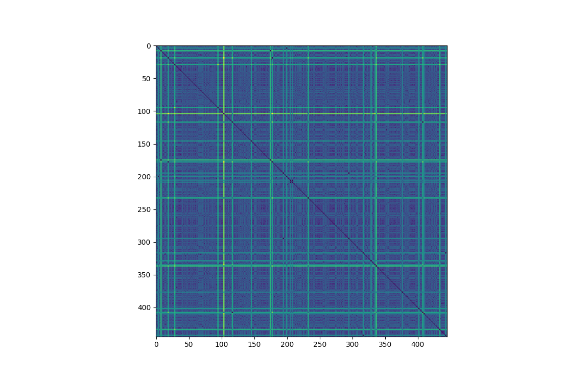
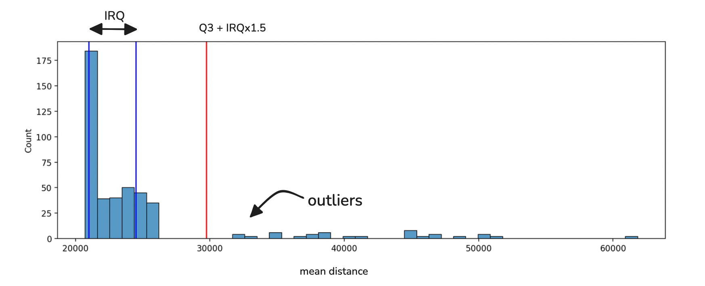
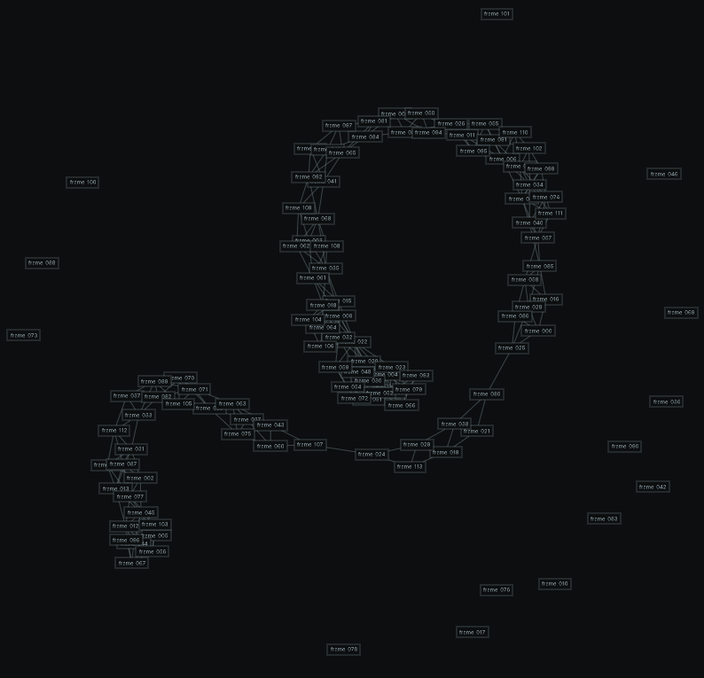

# Video Descrambler

## Demo

https://github.com/user-attachments/assets/bba610e3-22fa-47ed-b2dd-fe70f50fa457

## Introduction

Originaly given as a fun exercise, this project provides a tool to reconstruct corrupted video files where the frames have been shuffled and extraneous "junk" frames have been introduced. It reorders the video frames into their correct sequence and removes the frames that are not part of the original video.

## Installation and Usage

### Installation

Using [`uv`](https://docs.astral.sh/uv/) is recommended for environment and package management.

Create a virtual environment and activate it:

```bash
uv venv
source .venv/bin/activate
```

Install the app:

```bash
uv pip install .
```

### CLI Usage

The project comes with a command-line interface for easy use.

To descramble a video, call the `video-descrambler` tool:
```bash
video-descrambler corrupted_video.mp4 -o fixed_video.mp4
```

### Programmatic Usage

You can also use the `VideoDescrambler` class directly in your Python code.

```python
from pathlib import Path
from video_descrambler import VideoDescrambler

# Create a descrambler with the default pixel-based method
descrambler = VideoDescrambler.pixel_based()

# Run the descrambling pipeline
sequence = descrambler.descramble(
    video_path=Path("scrambled_video.mp4"),
    output_path=Path("fixed_video.mp4")
)

print(f"Descrambled video saved. Frame sequence: {sequence}")
```

## Problem Introduction and Prior Art

In 2016, Ned Danyliw published ["Video Reconstruction from Randomized Video Frames"](https://web.stanford.edu/class/ee368/Project_Autumn_1617/Reports/report_danyliw.pdf) where he tackles the exact same problem, with the exception of the random frames that are added to the scrambled video. My solution follows the same idea while simplifying greatly the algorithm:

The video descrambling process is a pipeline of several steps. The project is designed with a modular architecture, where each major step is an abstract "block" with a specific implementation, allowing for easy extension and experimentation with different algorithms.

The pipeline consists of:

1. **Frame Preprocessing**: Similar to what's done in Ned Danyliw work, I resize frames by half-resolution and convert them to grayscale to reduce the computation in further steps.

2.  **Feature Extraction**: Each frame is processed to extract a feature vector that represents its content. The default implementation (`RawPixelExtractor`) uses the raw pixel in a 1-D representation. This is implemented via the `FeatureExtractor` abstract base class. Other feature extractions methods can could be tested are histogramss, keypoints and descriptors (SIFT, ORB), Machine-learning feature extractors, perceptual hashing (PHash) etc...

2.  **Distance Calculation**: A pairwise distance matrix is computed between the feature vectors of all frames. This $N\times N$ matrix represents how different each frame is from every other frame. The default (`PixelDistanceCalculator`) uses the Euclidean distance. This is implemented via the `DistanceCalculator` abstract base class. Other distance metrics that could be used are Structural Similarity between frames (SSIM), Optical flow magnitude (Low magnitude means frames are closer), mean or median displacement using keypoints and descriptors etc...

An example distance matrix can be seen here.



3.  **Outlier Filtering**: To remove junk frames that are not part of the original sequence an outlier detection step is performed. The current implementation uses an IQR (Interquartile Range) based method on the mean distances of each frame to all others. Frames that are too dissimilar from the rest are discarded. This approach may need to be refined. This step can be optional depending on the subsequent sequencer implementation.
The following histogram showcase the IRQ filtering method :



4.  **Sequencing**: Once we have the distance matrix, the problem is to find the correct order of the remaining frames, we can see the distance matrix as a graph of interconnected frames where edge weights are distances. Finding the right sequence means finding the minumum cost hamiltonian path. This can also be modeled as a Traveling Salesman Problem (TSP) with the slight difference that a TSP solver will find a "tour" looping back to the first node. The `TSPSequencer` handles this by first solving the TSP to find the shortest tour, and then converting the circular tour into a linear path by finding the largest distance gap between consecutive frames in the tour and breaking the tour at that point. This is handled by the `Sequencer` abstract base class. The default implementation (`TSPSequencer`) uses the `fast-tsp` library to find a near-optimal solution very quickly.

When taking only the closest neighbors from the distance matrix and plotting the graph, we can see the outline of the sequence from the videos, and the outliers outside the graph :



## Complexity Analysis

The runtime of the descrambling process is dominated by a few key steps:

-   **Feature Extraction**: This step processes each frame individually. Its complexity is $O(n)$, where n is the number of frames.
-   **Distance Calculation**: This step computes the distance between every pair of frames, resulting in a complexity of $O(n^2)$.
-   **TSP Solving**: The Traveling Salesman Problem is NP-hard, a brute-force solution would be $O(n!)$ which is infeasible. This project uses the [`fast-tsp`](https://fast-tsp.readthedocs.io/en/latest/) library, which implements a Stochastic Local Search (SLS) heuristic. This algorithm finds a near-optimal solution in a very short amount of time, rather than a guaranteed optimal but much slower solution.

Space complexity is mostly related to the size of the distance matrix ($n\times n$), because pairwise distance computation could be performed using only one pair of features at a time.

## Limitations and Possible Improvements

- **Sequence direction**: Once we find the minumum cost hamiltonian path, we have no way of knowing the direction of the video. One way to tackle this issue would be to submit the sequence to a LLM with vision capabilty and a semantic understanding of the direction of scene.
- **Audio is Ignored**: The current implementation only considers the visual information in the video frames. Any accompanying audio track is ignored and not used for sequencing, nor is it reconstructed in the output. It should however be straitforward to reconstruct the audio file by re-slicing it
- **Outlier Detection**: The IQR-based outlier detection is very basic and not very robust for all scenarios and could potentially remove valid frames or keep junk frames.
- **Runtime improvements**: For long sequences runtime can be longbecause of the $n^2$ pairwise-distance computation. One optimisation could be to compute a first rough distance matrix (using phash and hamming distance for instance) and then use a more precise distance metric during the sequencing phase, avoiding computing this costly distance for every pair, and caching the result to compute only once.

## SBOM

| Name                   | Version   | License                 |
|------------------------|-----------|-------------------------|
| Pygments               | 2.19.2    | BSD License             |
| click                  | 8.3.1     | BSD-3-Clause            |
| fast_tsp               | 0.1.4     | MIT                     |
| joblib                 | 1.5.2     | BSD License             |
| markdown-it-py         | 4.0.0     | MIT License             |
| mdurl                  | 0.1.2     | MIT License             |
| numpy                  | 2.2.6     | BSD License             |
| opencv-python-headless | 4.12.0.88 | Apache Software License |
| rich                   | 14.2.0    | MIT License             |
| ruff                   | 0.14.6    | MIT License             |
| scikit-learn           | 1.7.2     | BSD-3-Clause            |
| scipy                  | 1.16.3    | BSD License             |
| shellingham            | 1.5.4     | ISC License (ISCL)      |
| threadpoolctl          | 3.6.0     | BSD License             |
| typer                  | 0.20.0    | MIT License             |
| typing_extensions      | 4.15.0    | PSF-2.0                 |
| video-descrambler      | 1.0.0     | BEERWARE                |
